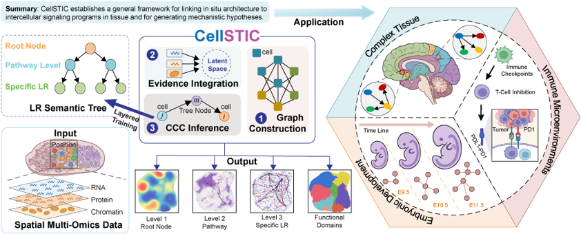
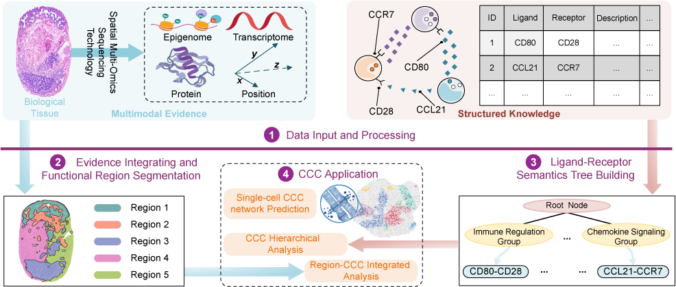

# CellSTIC

Decoding Hierarchical Cell-Cell Communication in Spatial Multi-Omics with CellSTIC.
**Preprint:** [https://doi.org/10.64898/2026.05.27.728114](https://doi.org/10.64898/2026.05.27.728114)

<p align="center">
  
</p>

## Method

CellSTIC integrates spatial multi-omics evidence, functional region segmentation, and a ligand–receptor semantics tree to infer hierarchical cell–cell communication (CCC).

<p align="center">
  
</p>

## Installation

```bash
conda env create -f environment.yml
conda activate cellstic
```

Run the tutorials from `notebook/`; each notebook adds the project root to `sys.path` automatically. **Start Jupyter with the repository root as the working directory.**

## Project Structure

| Directory | Description |
|-----------|-------------|
| `model/` | `CellSTIC`, HODGNN, graph construction, hierarchy tree |
| `pipeline/` | Training, evaluation, analysis, and `run_cellstic` entry point |
| `utils/` | Data preprocessing, analysis tools, metrics, viz |
| `config/` | Experiment YAML configs |
| `data/` | Raw and preprocessed data |
| `component/` | Simulators and component-level modules (e.g. synthetic spatial patterns) |
| `notebook/` | Step-by-step Jupyter tutorials (`.ipynb`) |

## Dependencies

- Single-cell / spatial: `anndata`, `scanpy`, `celltypist`
- Deep learning: `torch`, `dgl`
- Graphs: `igraph`, `networkx`, `louvain`
- General: `numpy`, `pandas`, `scipy`, `matplotlib`, `scikit-learn`, `PyYAML`, `h5py`, `tqdm`
- Embedding model files: download and place `bge-base-en-v1.5` manually at `component/bge-base-en-v1.5`
- Aliyun LLM config: either manually set `api_key`, `region`, and `base_url` in `config/aliyun_config.yaml` (section `aliyun`), or use the helper API below (do not commit real keys)

See `requirements.txt` and `environment.yml` for details.

## Quick Start

**Workflow**: load / preprocess `AnnData` in the matching notebook → `run_cellstic` → `SingleLevelAnalysis.from_adata`. See `notebook/*.ipynb` and `data/<dataset>/README.md`.

Each modality needs `obsm["feat"]`, `obsm["spatial"]`, and (recommended) `obsp["spatial_distances"]`.

```python
from pathlib import Path
import torch
from pipeline import run_cellstic
from utils.tools.seed_utils import set_global_seed

set_global_seed()

# After loading/preprocessing in notebook/scmultisim.ipynb (or another tutorial):
result = run_cellstic(
    modality_datas=[rna, atac],
    ligand_receptor_map=lr_map,
    model_path=Path("data/scmultisim/re1/model"),
    output_path=Path("data/scmultisim/re1/result"),
    device=torch.device("cuda" if torch.cuda.is_available() else "cpu"),
)

from pipeline.analyzer import SingleLevelAnalysis

analysis = SingleLevelAnalysis.from_adata(result.adata, output_path=Path("data/scmultisim/re1/analysis"))
analysis.run_cell_type_heatmaps()
```

**Analysis** (`pipeline.analyzer`): `SingleLevelAnalysis`, `TreeLevelAnalysis`, `TimeSequenceAnalysis`, `DomainAnalysis`.

**Low-level API** (optional): `build_config` → `CellSTICTrainer` → `CellSTICEvaluator`. Prefer `run_cellstic`.

### Aliyun LLM configuration (optional)

For Aliyun-based LLM tools (used only in optional helper utilities), edit `config/aliyun_config.yaml` or call `utils.tools.aliyun_utils.set_aliyun_config`. Not required for core experiments. Never commit real API keys.

## Tutorial notebooks

| Notebook | Dataset |
|----------|---------|
| `notebook/scmultisim.ipynb` | scMultiSim replicates re1–re8 |
| `notebook/mouse_embryo.ipynb` | Mouse embryo Stereo-seq |
| `notebook/mouse_brain.ipynb` | Mouse brain 5M |
| `notebook/human_lymph_node.ipynb` | Human lymph node |
| `notebook/axolotl_develop.ipynb` | Axolotl telencephalon (development) |
| `notebook/axolotl_regene.ipynb` | Axolotl telencephalon (regeneration) |

## Feedback

Bug reports, questions, and feature suggestions: please [open an issue](https://github.com/xuyungang/CellSTIC/issues) on GitHub.

## License

GNU General Public License v3.0. See [LICENSE](LICENSE).
